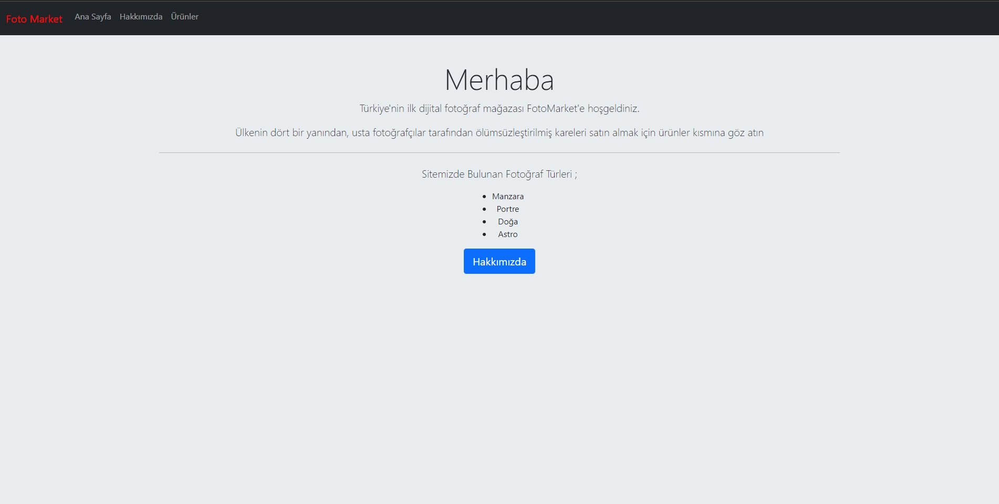

# Bootstrap Birinci Ödev

## [Patika](www.patika.dev)'in Front-End Web patikası kapsamındaki Bootstrap derleri birinci ödevi

- Bu ödevde bootstrap ile navigation bar yapımını ve card sistemini öğrendim.

- Grid Sistem ile çalışma konusunda ve bootstrap temelleri konusunda oldukça fazla pratik yaptım.
- Dökümantasyonu olabildiğince iyi kullanmaya çalıştım.

### Proje-SS

[License](LICENSE)